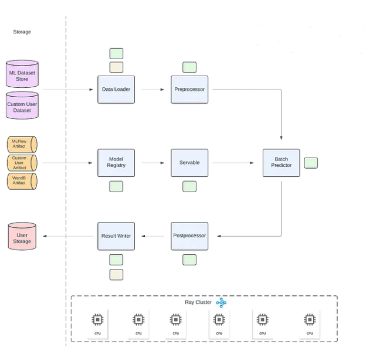

# OmniRay

## ToDo

- Data Loader
    - [x] Add support for huggingface datasets
    - [x] Add support for PyTorch DataLoader
    - [x] Add support for numpy DataLoader
    - [x] Add support for pandas DataLoader
- Data Connector
    - [ ] Add support for various streaming data sources
        - [ ] Add support for Kafka
        - [ ] Add support for Kinesis
        - [ ] Add support for Redis
    - [ ] Add support for various batch data sources
        - [ ] Add support for S3
        - [ ] Add support for SQLAlchemy Loader
        - [ ] Add support for MongoDB Loader
- Model Registry
    - [x] Add support for S3 registry
    - [ ] Add support for MLFlow registry
- Batch Predicor
    - [ ] Add support for vLLM batch predictor
    - [ ] Add support for PyTorch batch predictor
    - [ ] Add support for HuggingFace (with safetensor) batch predictor

## References

- [Ray Batch Inference at Pinterest (Part 3)](https://medium.com/pinterest-engineering/ray-batch-inference-at-pinterest-part-3-4faeb652e385)
- [Batch Predictions in Ray](https://docs.ray.io/en/latest/ray-core/examples/batch_prediction.html)
